# Enterprise Experience Platform

A comprehensive microservices-based platform for employee experience management, surveys, analytics, and automation.

## Architecture

```mermaid
graph TB
    subgraph "Frontend"
        WEB[Web App - Next.js]
        MOBILE[Mobile App - React Native]
    end
    
    subgraph "API Gateway"
        TRAEFIK[Traefik]
    end
    
    subgraph "Microservices"
        ID[Identity Service]
        ORG[Organization Service]
        SURVEY[Survey Engine]
        AI[AI/ML Service]
        ACTION[Action Planner]
        REPORT[Reporting Service]
        WORKFLOW[Workflow Automation]
        INTEGRATION[Integration Marketplace]
        NOTIF[Notification Service]
        PERF[Performance Service]
        FEEDBACK[Feedback Service]
        BLOCKCHAIN[Blockchain Service]
    end
    
    subgraph "Infrastructure"
        POSTGRES[(PostgreSQL)]
        REDIS[(Redis)]
        RABBITMQ[RabbitMQ]
        KAFKA[Kafka]
        NEO4J[(Neo4j)]
    end
    
    subgraph "Monitoring"
        PROM[Prometheus]
        GRAF[Grafana]
        JAEGER[Jaeger]
        LOKI[Loki]
    end
    
    subgraph "Automation"
        N8N[n8n]
    end
    
    WEB --> TRAEFIK
    MOBILE --> TRAEFIK
    TRAEFIK --> ID
    TRAEFIK --> ORG
    TRAEFIK --> SURVEY
    TRAEFIK --> AI
    TRAEFIK --> ACTION
    TRAEFIK --> REPORT
    TRAEFIK --> WORKFLOW
    TRAEFIK --> INTEGRATION
    TRAEFIK --> NOTIF
    TRAEFIK --> PERF
    TRAEFIK --> FEEDBACK
    TRAEFIK --> BLOCKCHAIN
    
    ID --> POSTGRES
    ORG --> POSTGRES
    SURVEY --> POSTGRES
    AI --> POSTGRES
    ACTION --> POSTGRES
    REPORT --> POSTGRES
    WORKFLOW --> POSTGRES
    INTEGRATION --> POSTGRES
    NOTIF --> POSTGRES
    PERF --> POSTGRES
    FEEDBACK --> POSTGRES
    BLOCKCHAIN --> POSTGRES
    
    ORG --> NEO4J
    SURVEY --> REDIS
    WORKFLOW --> RABBITMQ
    INTEGRATION --> KAFKA
    NOTIF --> N8N
    
    ID --> PROM
    ORG --> PROM
    SURVEY --> PROM
    AI --> PROM
```



## Features

### Core Services

1. **Identity Service** - Multi-tenant authentication with SSO, MFA, AD/LDAP integration, SCIM 2.0, and zero-trust security
2. **Organization Service** - Advanced hierarchy modeling with AI-powered org simulations and Neo4j integration
3. **Survey Engine** - 100+ question types, DEI templates, real-time collaboration, VR/AR modes, blockchain verification
4. **AI/ML Service** - Predictive models, Ollama integration, multimodal AI (vision + text), federated learning
5. **Action Planner** - Automated workflows from AI insights with reinforcement learning optimization
6. **Reporting Service** - BI-level analytics, real-time dashboards, AR visualizations, AI-narrated reports
7. **Workflow Automation** - No-code/low-code workflows with AI-assisted design and n8n integration
8. **Integration Marketplace** - 100+ connectors including blockchain, IoT, HRIS systems
9. **Notification Service** - Multi-channel notifications with AI-personalized content and n8n automation
10. **Performance Service** - Reviews, feedback, goals with gamification and VR simulations
11. **Feedback Service** - Real-time feedback with sentiment-based routing and auto-escalation
12. **Blockchain Service** - Tamper-proof surveys and compliance audits

### Infrastructure

- **API Gateway**: Traefik with dynamic routing, rate limiting, OAuth scopes, and circuit breakers
- **Message Brokers**: RabbitMQ (AMQP) and Kafka (high-throughput events)
- **Databases**: PostgreSQL (primary), Neo4j (graph), Redis (cache)
- **Monitoring**: Prometheus, Grafana, Jaeger (tracing), Loki (logs)
- **Security**: HashiCorp Vault, OPA policies, Sealed Secrets
- **Automation**: n8n for workflow automation
- **Deployment**: Kubernetes with Helm charts, auto-scaling, Istio service mesh

## Quick Start

### Prerequisites

- Docker and Docker Compose
- Python 3.11+ with Poetry
- Node.js 18+ with npm
- Kubernetes cluster (for production)
- Helm 3+

### Local Development

1. **Clone the repository**
   ```bash
   git clone <repository-url>
   cd ex_platform_project
   ```

2. **Set up environment variables**
   ```bash
   cp .env.example .env
   # Edit .env with your configuration
   ```

3. **Start infrastructure services**
   ```bash
   make dev-up
   ```

4. **Install dependencies**
   ```bash
   make install
   ```

5. **Run database migrations**
   ```bash
   make migrate
   ```

6. **Start services**
   ```bash
   # Each service can be started individually or via docker-compose
   cd services/1-identity_service
   poetry run python manage.py runserver
   ```

### Production Deployment

1. **Build Docker images**
   ```bash
   make build
   ```

2. **Deploy to Kubernetes**
   ```bash
   make deploy-k8s
   ```

3. **Deploy n8n workflows**
   ```bash
   make deploy-n8n-workflows
   ```

## API Documentation

API documentation is available via Swagger UI at `/api/docs` when services are running.

### Service Endpoints

- Identity Service: `http://localhost:8001/api/v1/`
- Organization Service: `http://localhost:8002/api/v1/`
- Survey Engine: `http://localhost:8003/api/v1/`
- AI/ML Service: `http://localhost:8004/api/v1/`
- Action Planner: `http://localhost:8005/api/v1/`
- Reporting Service: `http://localhost:8006/api/v1/`
- Workflow Automation: `http://localhost:8007/api/v1/`
- Integration Marketplace: `http://localhost:8008/api/v1/`
- Notification Service: `http://localhost:8009/api/v1/`
- Performance Service: `http://localhost:8010/api/v1/`
- Feedback Service: `http://localhost:8011/api/v1/`
- Blockchain Service: `http://localhost:8012/api/v1/`

## Scaling Guide

### Horizontal Scaling

Services are designed to scale horizontally. Use Kubernetes HPA (Horizontal Pod Autoscaler) based on CPU and memory metrics.

### Database Scaling

- PostgreSQL: Use read replicas for read-heavy workloads
- Redis: Use Redis Cluster for high availability
- Neo4j: Use Neo4j Cluster for graph database scaling

### Message Broker Scaling

- RabbitMQ: Use RabbitMQ Cluster for high availability
- Kafka: Use Kafka brokers in a cluster configuration

## Security

- **Authentication**: JWT tokens with refresh tokens
- **Authorization**: RBAC with OPA policies
- **Secrets Management**: HashiCorp Vault
- **Encryption**: TLS for all communications, encryption at rest
- **Compliance**: GDPR, SOC 2, HIPAA ready
- **Zero-Trust**: Network policies and service mesh

## Monitoring

- **Metrics**: Prometheus for metrics collection
- **Visualization**: Grafana dashboards
- **Tracing**: Jaeger for distributed tracing
- **Logs**: Loki for log aggregation
- **Alerts**: AlertManager for alerting

## Testing

```bash
# Run all tests
make test

# Run tests for a specific service
cd services/1-identity_service
poetry run pytest

# Run security scans
make security-scan
```

## Contributing

1. Fork the repository
2. Create a feature branch
3. Make your changes
4. Add tests
5. Submit a pull request

## License

[Your License Here]

## Support

For support, email support@example.com or open an issue in the repository.

